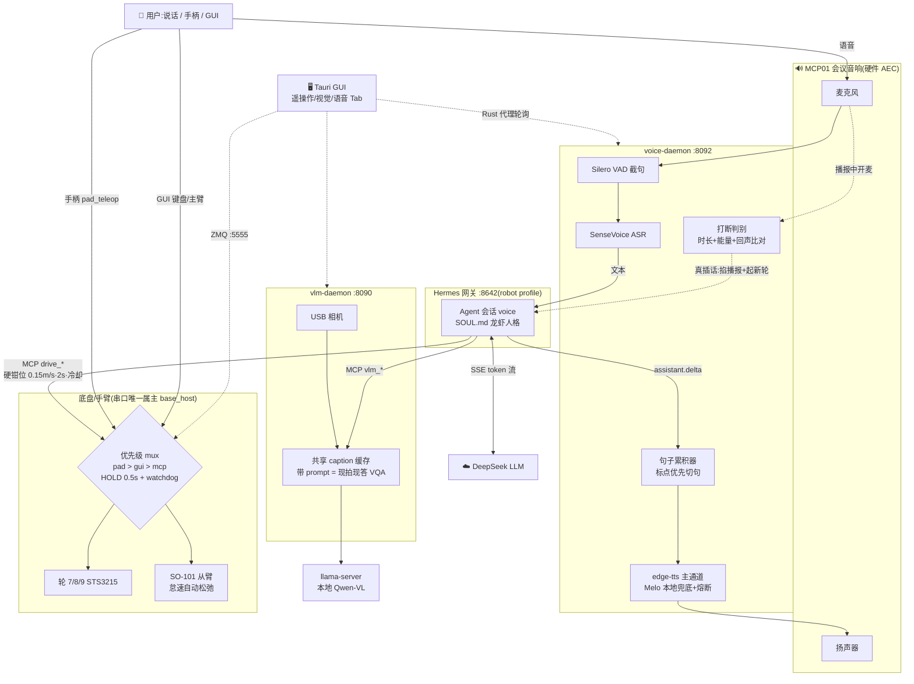

# LeKiwi on Jetson Orin Nano

LeKiwi 移动操作机器人(3 轮全向底盘 + SO-101 从臂,Feetech STS3215 总线舵机 ×9)
跑在 Jetson Orin Nano 8GB(JetPack 6.2.2)上,软件栈 lerobot 0.5.2。

| 目录 | 内容 |
|---|---|
| `gui/` | Tauri 桌面控制台(键盘/主臂遥操作 + 视觉 + 语音 Tab) |
| `board/` | 板端程序(1:1 镜像板子文件系统):base_host、手柄 daemon、总线诊断、systemd 单元 |
| `vlm/` | 视觉 daemon(:8090,相机 + 本地 Qwen-VL 解读)+ 只读视觉 MCP |
| `voice/` | 语音前端 daemon(:8092,VAD + SenseVoice ASR + edge/Melo TTS + 打断) |
| `drive/` | 受限控车 MCP(schema 硬钳位,语音/LLM 开车的唯一入口) |
| `scripts/` | `deploy_board.sh`(rsync `board/` 到板 + 重启服务) |
| `docs/` | 玩法总览、遥操作实施方案、手柄键位说明(HTML,可离线浏览) |
| `notebooks/` | 手动试车 notebook |
| `.memory/` | 项目长期记忆(协议见 `.memory/SKILL.md`) |

## 快速开始 Quick start

板子(`jatson@192.168.3.188`)上 `base_host` 与 `pad_teleop` 已做成 systemd 开机自启:
手柄接收器插板即可遥控;桌面端 `cd gui && ./run.sh` 起 GUI 键盘遥控。
键位、部署、架构详见 `gui/README.md`。

## 语音智能体 Hermes(龙虾)

机器人的"大脑"是 Hermes Agent(板上安装于 `~/.hermes/hermes-agent`),
以 **robot profile** 跑一个本地网关,LLM 用云端
DeepSeek,眼睛和轮子通过 MCP 挂载。人格与守则见 `~/.hermes/profiles/robot/SOUL.md`
(机器人自称"龙虾")。



板上相关 systemd 服务(均开机自启):

| 服务 | 作用 |
|---|---|
| `hermes-gateway-robot`(user) | Hermes 网关,API :8642,拉起 vlm/drive 两个 MCP 子进程 |
| `voice-daemon`(user) | 语音前端 :8092(GUI 语音 Tab 经 Tauri 代理访问) |
| `vlm-daemon`(user) | 相机采集 + 本地 VLM 解读 :8090 |
| `llama-server`(user) | 本地 Qwen-VL 推理后端 |
| `base_host` / `pad_teleop`(system) | 底盘/手臂串口宿主(ZMQ :5555)、手柄遥控 |

运维要点:

- **重启网关**:`systemctl --user restart hermes-gateway-robot`。
  ⚠️ 裸敲 `hermes gateway restart`(不带 `--profile robot`)起的是**默认 profile**
  的前台网关(会连 Lark、阻塞终端),与机器人无关。
- 改了 `vlm/`、`drive/` 的 MCP 源码后必须重启网关——MCP 是网关拉起的子进程。
- MCP 挂载与模型配置:`~/.hermes/profiles/robot/config.yaml`。
- 底盘指令有优先级仲裁(base_host 内):**手柄 > GUI 键盘 > 龙虾(MCP)**,
  高优先级源活动的 0.5 s 内低优先级底盘帧直接丢弃;按住手柄急停可压制 LLM 开车。
  无人值守运行仍 gate 在 base_host v2 仲裁器(未完成),当前为有人监督档。

## 机械臂标定 Arm calibration(lerobot-calibrate)

臂关节标定用 lerobot 自带 CLI,流程 = **摆中间位 → 回车 → 每关节手动拉到最大最小 → 回车确认**。
需要交互终端,在板子上跑:

```bash
# 1) 先按手柄 START 收臂松弛(臂折回休息位并断扭矩),再释放串口
ssh -t jatson@192.168.3.188
sudo systemctl stop base_host pad_teleop

# 2) 标定(lerobot conda env)
conda activate lerobot
lerobot-calibrate \
  --robot.type=lekiwi \
  --robot.port=/dev/serial/by-id/usb-1a86_USB_Single_Serial_5B61036495-if00 \
  --robot.id=orin_kiwi \
  --robot.cameras='{}'
# --robot.cameras='{}' 必须带：lekiwi 默认配置含 front/wrist 两个相机，
# 没插相机时 connect() 会先在开相机处崩掉；标定不需要相机。

# 3) 恢复手柄遥控
sudo systemctl start base_host pad_teleop
```

交互两步:

1. 提示 *Move robot to the middle of its range of motion* —— 此时臂扭矩已松(**扶住,会掉**),
   手动把 6 个关节摆到行程中间的标准姿态,回车(定零位);
2. 屏幕实时刷各关节 min/max —— 把每个关节依次拉到两端极限(到位即可,别硬顶),
   全部过一遍后回车确认。轮子 7/8/9 连续旋转,不参与。

结果写入 `~/.cache/huggingface/lerobot/calibration/robots/lekiwi/orin_kiwi.json`。
标定后原版 `python -m lerobot.robots.lekiwi.lekiwi_host` 才能启动(它强制要标定),
完整 lerobot 流程(leader 遥操作 / 录数据 / 跑策略)随之解锁;base_host/手柄遥控本身不依赖标定。
