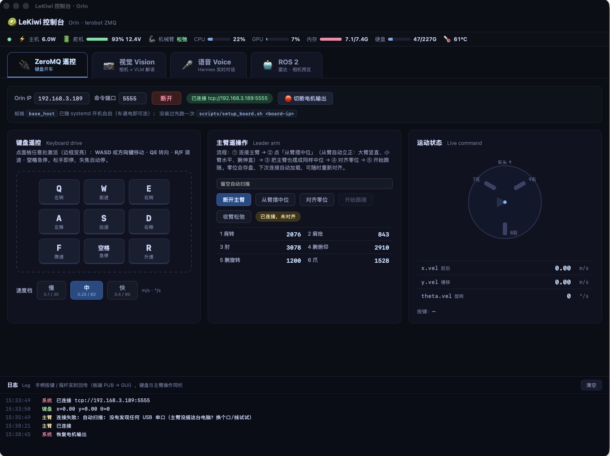
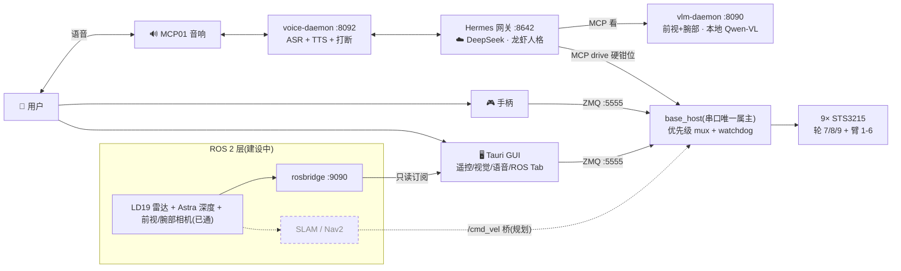
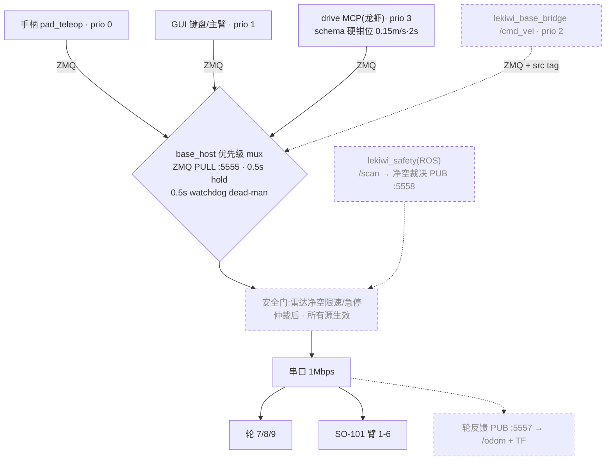
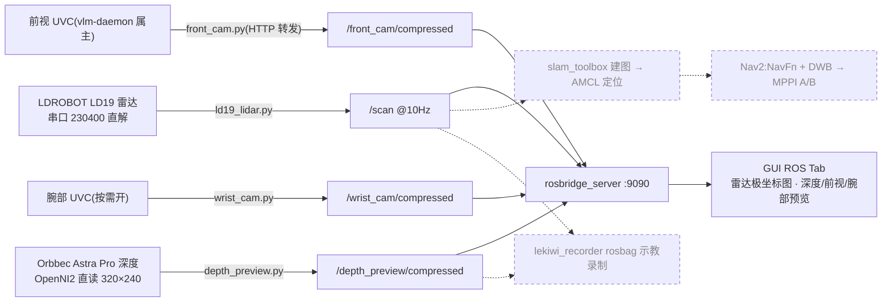
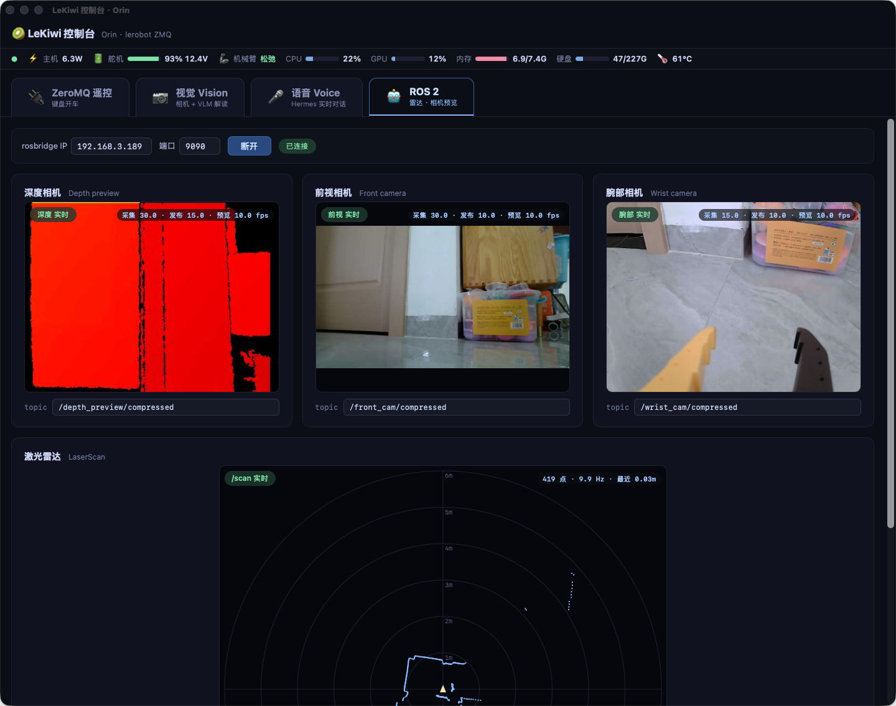
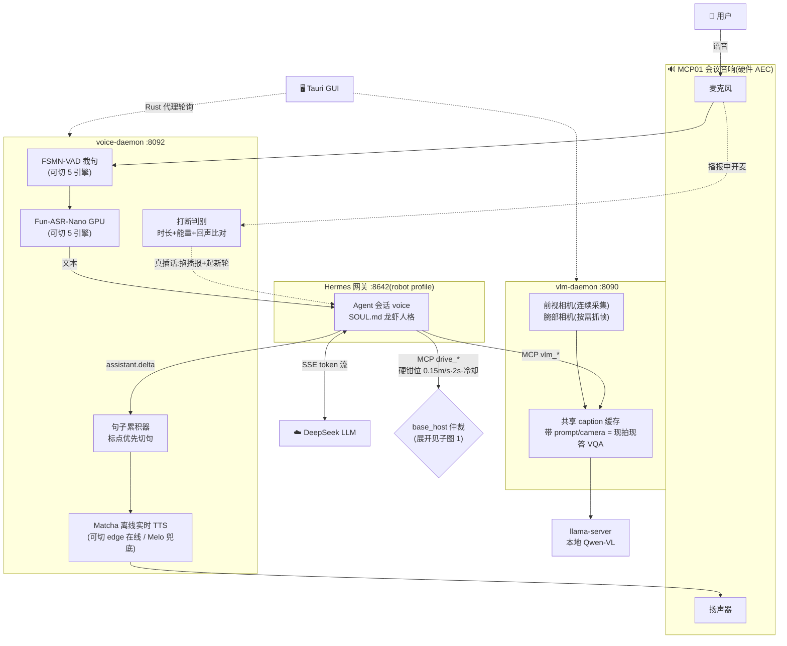
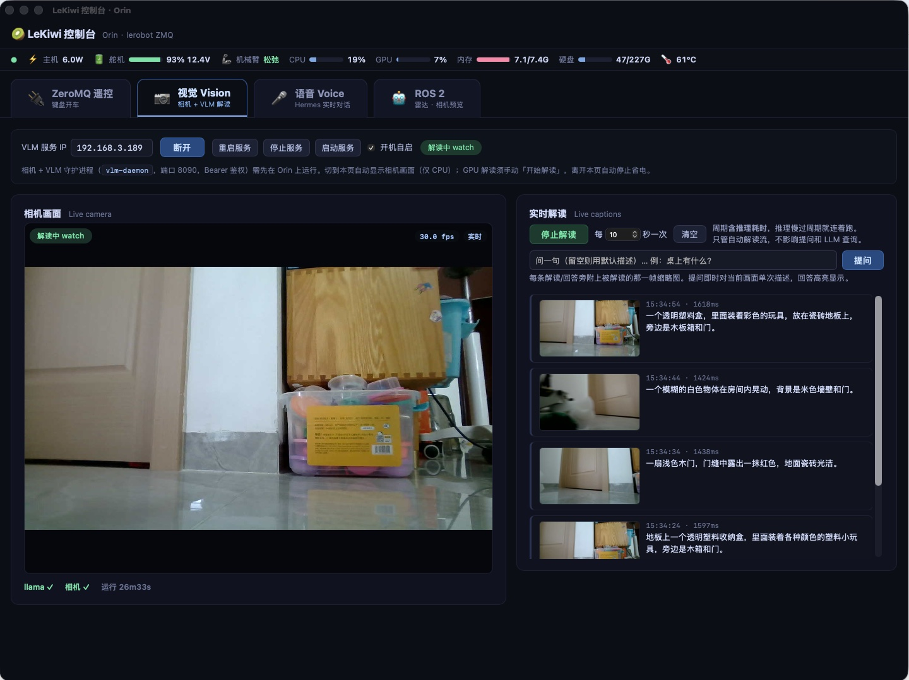
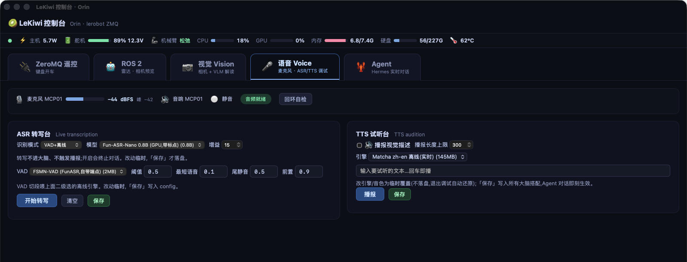
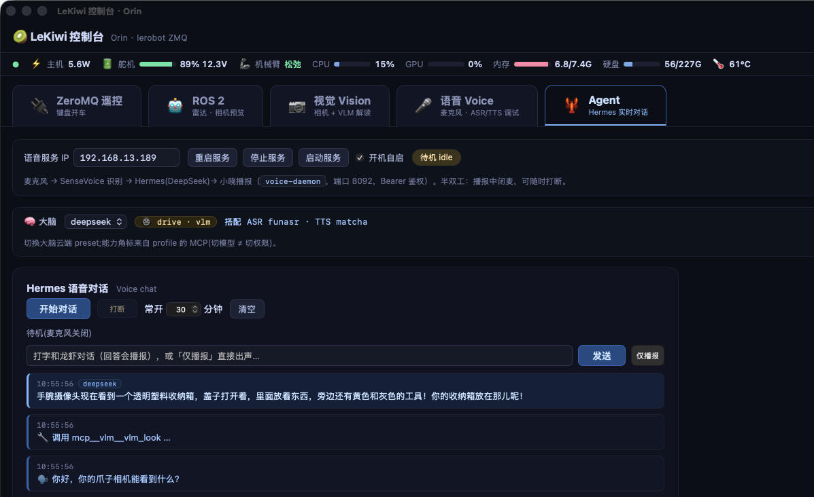

# LeKiwi on Jetson Orin Nano

LeKiwi 移动操作机器人(3 轮全向底盘 + SO-101 从臂,Feetech STS3215 总线舵机 ×9)
跑在 Jetson Orin Nano 8GB(JetPack 6.2.2)上,软件栈 lerobot 0.5.2。

上游开源硬件项目:[LeKiwi(lerobot 官方文档)](https://huggingface.co/docs/lerobot/lekiwi)
——原设计主控是树莓派,本仓库是其 **Jetson Orin Nano 移植**(维特智能散件版),
并在 lerobot 原生 ZMQ 遥控之上叠加了语音智能体与 ROS 2 感知层。

| 目录 | 内容 |
|---|---|
| `gui/` | Tauri 桌面控制台(键盘/主臂遥操作 + 视觉 + 语音 + ROS 2 感知预览 Tab) |
| `board/` | 板端程序(1:1 镜像板子文件系统):base_host、手柄 daemon、总线诊断、systemd 单元 |
| `vlm/` | 视觉 daemon(:8090,前视+腕部双相机 + 本地 Qwen-VL 解读)+ 只读视觉 MCP |
| `voice/` | 语音前端 daemon(:8092,5 档 VAD + 5 引擎 ASR(默认 Fun-ASR GPU)+ 3 引擎 TTS(默认 Matcha 离线)+ 打断) |
| `drive/` | 受限控车 MCP(schema 硬钳位,语音/LLM 开车的唯一入口) |
| `scripts/` | `deploy_board.sh`(rsync `board/` 到板 + 重启服务) |
| `docs/` | 玩法总览、遥操作方案、手柄键位、Agent/Voice 页设计、语音引擎全景(HTML,可离线浏览) |
| `notebooks/` | 手动试车 notebook |
| `.memory/` | 项目长期记忆(协议见 `.memory/SKILL.md`) |

## 快速开始 Quick start

板子(`jetson@<board-ip>`)上 `base_host` 与 `pad_teleop` 已做成 systemd 开机自启:
手柄接收器插板即可遥控;桌面端 `cd gui && ./run.sh` 起 GUI 键盘遥控。
键位、部署、架构详见 `gui/README.md`。



*ZeroMQ Tab:左键盘遥控 + 速度档,中主臂遥操作(关节实时读数),右底盘速度矢量可视化。
顶栏是 ssh 采集的板子遥测(功耗/舵机电池/机械臂扭矩/CPU/GPU/内存/温度),底部日志栏
汇总手柄、键盘、主臂三路操作。连接行的「切断电机输出」是安全总开关——闩锁在板端,
切断后 `base_host` 不再写电机,但收包、优先级仲裁、遥测照常,用于不动电机地调试链路。*

## 系统架构 System architecture

一张总图看数据流向,三张子图各管一个关注点(控制链路 / ROS 2 感知导航 / 语音视觉智能体)。
**实线 = 已跑通;虚线 + 「规划」= `docs/ros2-integration-plan.html` 中的阶段**。

### 总图:谁在跟谁说话



### 子图 1:控制链路——谁能动车

四个控制源汇到 base_host 一个仲裁器;安全门在仲裁**之后**,谁都绕不过(规划,见计划 P4)。



### 子图 2:ROS 2 感知与导航——现状与下一步

感知链路已全部端到端跑通(2026-07-20):深度 = Astra Pro(与 yahboom 参考项目同款)→
OpenNI2 直读(厂商 ROS 驱动的激光/LDP 是坏的,弃用)→ 伪彩 JPEG 15fps;雷达 = LDROBOT
LD19 串口直解(47 字节包 CRC8,by-id 路径防与舵机总线的同款 CH9102 芯片串号)→ /scan
10Hz;前视 = vlm-daemon `/frame.jpg` HTTP 转发(单属主,不双开设备);腕部 = 独立 UVC
按需采集(有订阅才开设备)。全部经 rosbridge → GUI。导航栈按计划分阶段。



板端 user 服务(开机自启):`rosbridge`(:9090)、`depth-preview`、`ld19-lidar`、
`front-cam`、`wrist-cam`(节点均带看门狗/自愈,崩溃或拔插由 systemd 拉起);udev 规则
`56-orbbec-usb.rules` 放行 2bc5 设备。**USB2 带宽铁律(yahboom 实测继承)**:Astra 的
UVC 彩色流一开,深度从 30fps 塌到 1.5fps——所以 Astra 彩色永不接;前视复用 vlm-daemon
已编码的 JPEG(零新增采集),腕部相机只在 GUI 订阅时开流,共享 USB2 总线不白烧带宽。



*ROS 2 Tab(只读订阅,控制仍走 ZeroMQ):三路相机 + 雷达极坐标图。角标三个帧率各有出处
且全为实测——「采集」= 传感器真实交付率、「发布」= 板端节点 ROS 输出率,两者由节点自数
并 1Hz 上报 `/diagnostics`(订阅端节流污染不到);「预览」= rosbridge 节流后的到达率。
图中腕部相机采集只有 15fps(标称 30),正是靠这套自报帧率才暴露出来的。*

### 子图 3:语音与视觉智能体

语音进出、大脑决策、视觉问答的细节;底盘侧收敛为一个仲裁节点(展开见子图 1)。





*视觉 Tab:左相机画面(纯 CPU,进 Tab 自动出画),右本地 Qwen-VL 解读流。解读占 GPU,
必须手动点「开始解读」,离开本页自动停。周期可调且**含推理耗时**——设 10 秒就是每 10 秒
开始一次推理,不随模型延迟漂移;推理慢过周期则连着跑。每条解读旁附**被解读的那一帧**
缩略图,不是当前帧——延迟几百毫秒时这个区别决定了你能不能判断模型看错没有。
此设置只管这条自动解读流,提问和 LLM 经 MCP 的实时查询都是按需推理,不受影响。*



*语音 Tab(调试台,进入即接管麦克风,退出自动还原):左 ASR 转写台——识别模式
(VAD+离线 / 流式免 VAD)→ 二级模型(图中 Fun-ASR-Nano 0.8B,GPU 带标点)→ VAD 引擎
(图中 FSMN-VAD,自带端点)+ 阈值/最短语音/尾静音/前置增益,转写不进大脑不触发播报;
右 TTS 试听台——引擎切换(图中 Matcha zh-en 离线实时,145MB)+ 任意文本试播。
所有改动默认**临时覆盖**(不落盘,退出调试自动还原),点「保存」才写入全部大脑搭配,
Agent 对话即刻用上新引擎——调参 A/B 与生产配置由此隔离。顶栏是麦克风实时电平
(dBFS+峰值)、音响状态与回环自检:一键「TTS 说一句→麦克风收→ASR 认」,把声学问题
和模型问题一刀切开。*

## 语音智能体 Hermes(龙虾)

机器人的"大脑"是 Hermes Agent(板上安装于 `~/.hermes/hermes-agent`),
以 **robot profile** 跑一个本地网关,LLM 用云端
DeepSeek,眼睛(前视 + 爪腕双相机)和轮子通过 MCP 挂载。人格与守则见
`~/.hermes/profiles/robot/SOUL.md`(机器人自称"龙虾")。数据流见上方「系统架构」子图 3。



*Agent Tab:大脑条(切云端 preset,能力角标来自 profile 的 MCP——切模型 ≠ 切权限;
右侧展示当前搭配的 ASR/TTS,即语音 Tab「保存」的结果)+ Hermes 实时对话流。截图正是
爪腕相机的完整调用链:问"你的爪子相机能看到什么?"→ 龙虾调 `vlm_look(camera=wrist)`
→ 用腕部真帧回答收纳箱里有什么。文字输入走与语音完全相同的对话链路(回答会播报),
「仅播报」则是 TTS 直通调试。对话窗常开分钟数即麦克风保活时长,离开本页不中断会话。*

板上相关 systemd 服务(均开机自启):

| 服务 | 作用 |
|---|---|
| `hermes-gateway-robot`(user) | Hermes 网关,API :8642,拉起 vlm/drive 两个 MCP 子进程 |
| `voice-daemon`(user) | 语音前端 :8092(GUI 语音 Tab 经 Tauri 代理访问) |
| `vlm-daemon`(user) | 相机采集 + 本地 VLM 解读 :8090 |
| `llama-server`(user) | 本地 Qwen-VL 推理后端 |
| `base_host` / `pad_teleop`(system) | 底盘/手臂串口宿主(ZMQ :5555)、手柄遥控 |

运维要点:

- **重启网关**:`systemctl --user restart hermes-gateway-robot`。
  ⚠️ 裸敲 `hermes gateway restart`(不带 `--profile robot`)起的是**默认 profile**
  的前台网关(会连 Lark、阻塞终端),与机器人无关。
- 改了 `vlm/`、`drive/` 的 MCP 源码后必须重启网关——MCP 是网关拉起的子进程。
- MCP 挂载与模型配置:`~/.hermes/profiles/robot/config.yaml`。
- 底盘指令有优先级仲裁(base_host 内):**手柄 > GUI 键盘 > 龙虾(MCP)**,
  高优先级源活动的 0.5 s 内低优先级底盘帧直接丢弃;按住手柄急停可压制 LLM 开车。
  无人值守运行仍 gate 在 base_host v2 仲裁器(未完成),当前为有人监督档。

## 机械臂标定 Arm calibration(lerobot-calibrate)

臂关节标定用 lerobot 自带 CLI,流程 = **摆中间位 → 回车 → 每关节手动拉到最大最小 → 回车确认**。
需要交互终端,在板子上跑:

```bash
# 1) 先按手柄 START 收臂松弛(臂折回休息位并断扭矩),再释放串口
ssh -t jetson@<board-ip>
sudo systemctl stop base_host pad_teleop

# 2) 标定(lerobot conda env)
conda activate lerobot
lerobot-calibrate \
  --robot.type=lekiwi \
  --robot.port=/dev/serial/by-id/usb-1a86_USB_Single_Serial_5B61036495-if00 \
  --robot.id=orin_kiwi \
  --robot.cameras='{}'
# --robot.cameras='{}' 必须带：lekiwi 默认配置含 front/wrist 两个相机，
# 没插相机时 connect() 会先在开相机处崩掉；标定不需要相机。

# 3) 恢复手柄遥控
sudo systemctl start base_host pad_teleop
```

交互两步:

1. 提示 *Move robot to the middle of its range of motion* —— 此时臂扭矩已松(**扶住,会掉**),
   手动把 6 个关节摆到行程中间的标准姿态,回车(定零位);
2. 屏幕实时刷各关节 min/max —— 把每个关节依次拉到两端极限(到位即可,别硬顶),
   全部过一遍后回车确认。轮子 7/8/9 连续旋转,不参与。

结果写入 `~/.cache/huggingface/lerobot/calibration/robots/lekiwi/orin_kiwi.json`。
标定后原版 `python -m lerobot.robots.lekiwi.lekiwi_host` 才能启动(它强制要标定),
完整 lerobot 流程(leader 遥操作 / 录数据 / 跑策略)随之解锁;base_host/手柄遥控本身不依赖标定。
